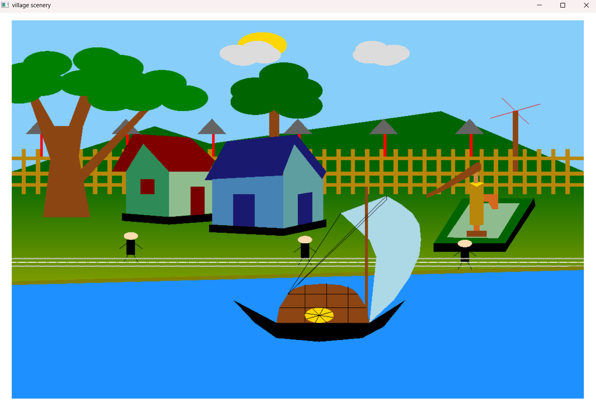

# 🌅 Smart Village Riverside Animation (OpenGL Project)


> A **realistic Smart Village simulation** built using **OpenGL & GLUT in C++**, showcasing a dynamic rural environment with animations and computer graphics algorithms.  
> This project was developed as part of the **Computer Graphics Lab (CSE412/422)** course at  
> **Daffodil International University**, demonstrating practical implementation of graphics concepts.

---

## 📑 Table of Contents
- [🌅 Smart Village Riverside Animation (OpenGL Project)](#-smart-village-riverside-animation-opengl-project)
  - [📑 Table of Contents](#-table-of-contents)
  - [🚀 Features](#-features)
  - [🛠️ Technologies Used](#️-technologies-used)
  - [📂 Project Structure](#-project-structure)
  - [⚙️ Installation \& Usage](#️-installation--usage)
  - [🖥️ Output](#️-output)
  - [🖥️ Example Workflow](#️-example-workflow)
  - [📊 Performance](#-performance)
  - [⚠️ Limitations](#️-limitations)
  - [📌 Future Improvements](#-future-improvements)
  - [👨‍💻 Contributors](#-contributors)
  - [🎓 Acknowledgment](#-acknowledgment)
  - [📅 April 2026](#-april-2026)

---

## 🚀 Features
- 🌾 Field, river, and sky environment
- ☁️ Cloud with smooth animation
- 🌞 Sun animation (left to right movement)
- 🌙 Day & night transition system (sun & moon)
- 🌳 Trees, fences, houses, and tubewell
- 🚤 Boat animation:
  - Movement (left to right)
  - Scaling control → `+` (Zoom in), `-` (Zoom out)
  - ⚙️ Gear rotation
- 🌀 Windmill rotation using **circle algorithm**
- 🚶 Walking path using **DDA algorithm**
- 👨‍👩‍👧 People with walking animation
- 🌧️ Rain system:
  - Keyboard control → `S` (Start), `T` (Stop)
  - Works in both day & night mode
- 🌌 Solar system visualization
- 🖥️ Full-screen animated environment

---

## 🛠️ Technologies Used
- **C++**
- **OpenGL**
- **GLUT (FreeGLUT)**
- **Computer Graphics Algorithms**
- **2D Transformations (Translation, Rotation, Scaling)**

---

## 📂 Project Structure
```bash
📁 smart-village-scenario-cg-project
|
├── 📁 output-demo
│   ├── 🖼️ img-1.png
│   ├── 🖼️ img-2.png
│   ├── 🖼️ img-3.png
│   ├── 🖼️ img-4.png
│   └── 🖼️ village.gif
├── 📁 project-report
│   └── 📕 project-report.pdf
├── 📝 README.md
└── ⚡ main.cpp
```

--- 

## ⚙️ Installation & Usage
- C++ Compiler (g++)
- OpenGL Library
- GLUT / FreeGLUT
  **Run the Project**

```bash
g++ main.cpp -o village -lGL -lGLU -lglut
./village
```

---
## 🖥️ Output
<div align="center">  </div>

---
## 🖥️ Example Workflow
```bash
1. Run the program
2. View animated village scene
3. Observe sun, cloud, and boat movement
4. Press '+' to zoom in boat
5. Press '-' to zoom out boat
6. Press 'S' to start rain
7. Press 'T' to stop rain
8. Watch day & night transition
```

---

## 📊 Performance
- ⚡ Smooth real-time rendering
- 💾 Low memory usage
- 🧠 Efficient implementation of DDA & Circle algorithms
- 🎯 Stable animation with multiple moving objects
  > Runs efficiently on standard computers without high-end GPU.

---

## ⚠️ Limitations
- Only 2D graphics (no 3D environment)
- No advanced lighting or shading
- No sound effects
- Limited user interaction (keyboard only)
- Basic shapes used for rendering

---

## 📌 Future Improvements
- 🎨 Add 3D environment & advanced lighting
- 🔊 Add sound effects (rain, wind, environment)
- 🖱️ Mouse interaction support
- 🌐 Convert to WebGL / browser-based project
- 🏘️ Expand smart village with more features
- ⚡ Optimize rendering performance

---

## 👨‍💻 Contributors

| Name                  | Student ID       |
| --------------------- | ---------------- |
| Shariar Ahamed Ripon  | 0242310005101019 |
| Md Moniruzzaman Rifat | 0242310005101020 |
| Sultana Asma Islam    | 0242310005101682 |

---

## 🎓 Acknowledgment
This project was completed as part of
**CSE412/422 – Computer Graphics Lab Department of Computer Science and Engineering Daffodil International University,** Dhaka, Bangladesh

---

## 📅 April 2026